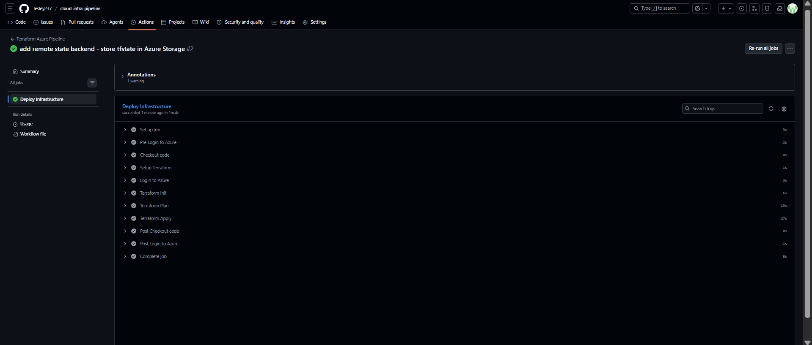
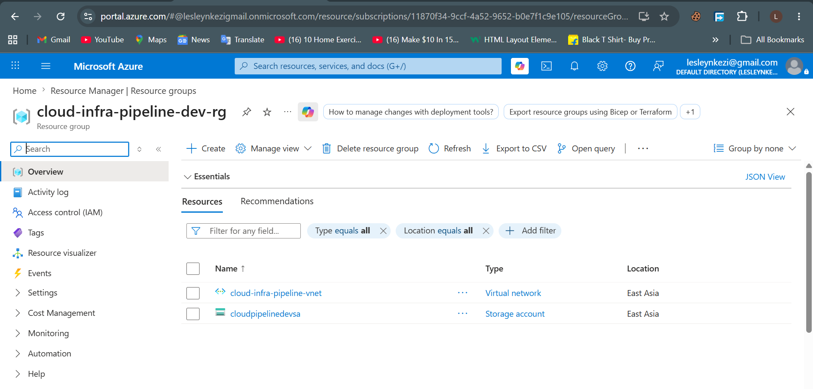
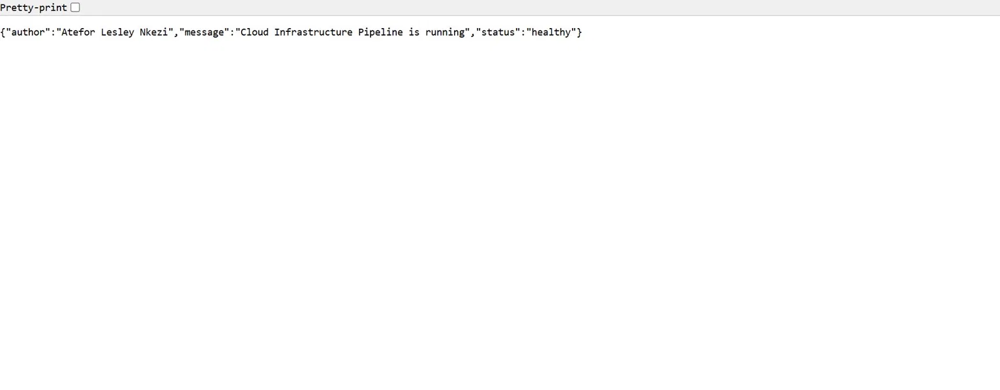
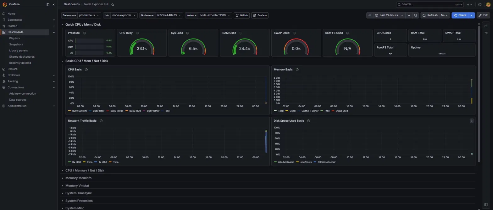
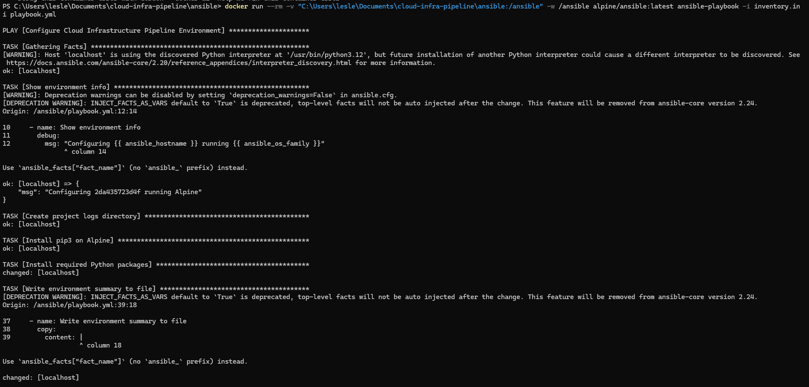
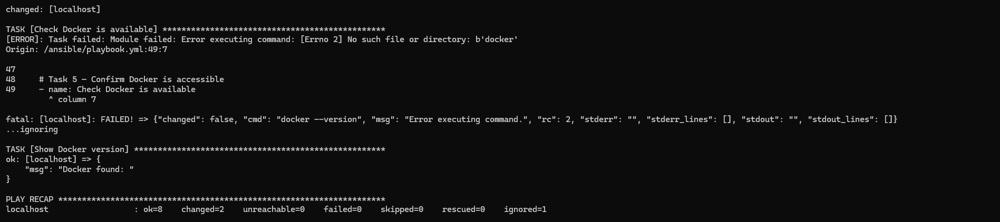

# Automated Cloud Infrastructure Deployment Pipeline

An end-to-end CI/CD pipeline that automatically provisions and manages Azure cloud infrastructure using Terraform, Docker, Kubernetes, Ansible, Prometheus, and Grafana. Every push to the main branch triggers a full automated deployment — no manual steps required.

## What this project does

- Pushes to GitHub trigger GitHub Actions automatically
- Terraform provisions Azure resources (Resource Group, VNet, Subnet, Storage Account)
- Remote Terraform state stored securely in Azure Blob Storage
- A Python Flask app is containerised with Docker and pushed to Docker Hub
- Kubernetes deploys 2 replicas with liveness health checks on the /health endpoint
- Ansible handles configuration management and environment setup
- Prometheus collects system metrics every 15 seconds
- Grafana displays live dashboards with CPU, memory, disk, and network data

## Tools used

| Tool             | Purpose                         |
|------------------|---------------------------------|
| Terraform        | Infrastructure as Code (IaC)    |
| GitHub Actions   | CI/CD pipeline automation       |
| Microsoft Azure  | Cloud infrastructure            |
| Docker           | Containerisation                |
| Kubernetes       | Container orchestration         |
| Ansible          | Configuration management        |
| Prometheus       | Metrics collection              |
| Grafana          | Monitoring dashboards           |

## Project structure

    cloud-infra-pipeline/
    ├── terraform/        Infrastructure as Code — Azure resources
    ├── app/              Python Flask app and Dockerfile
    ├── kubernetes/       Deployment and Service YAML files
    ├── ansible/          Configuration management playbooks
    ├── monitoring/       Prometheus and Grafana setup
    └── .github/
        └── workflows/    GitHub Actions CI/CD pipeline

## Screenshots

### GitHub Actions — Pipeline running green

### Azure Portal — Provisioned infrastructure

### App running in Kubernetes

### Grafana monitoring dashboard

### Ansible playbook output

### Ansible playbook output continuation

## Author

Atefor Lesley Nkezi

[LinkedIn](https://www.linkedin.com/in/atefor-lesley-nkezi-6a3760250) | [GitHub](https://github.com/lesley237)